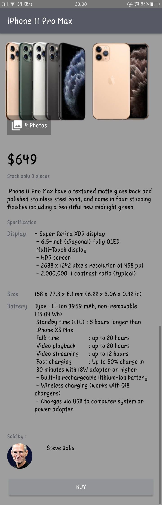

# Theme And Style

Hasil tampilan

- Masuk Aplikasi

- Tampilan Aplikasi

- Saat Button ditekan 

 

terdapat :

- linear layout, button, frame layout,image view, relative layout, dll dalam activity_main.xml

- untuk android:text sendiri mengambil teks dari string.xml 

-  pengaturan style mengambil dari string.xml agar lebih praktis

- dalam color.xml terdapat warna yang digunakan dalam tampilan aplikasi seperti color primary, color primary dark,dll

terimakasih:)

# Salsabilla Maurettasya A
# 39 / XI RPL 3
